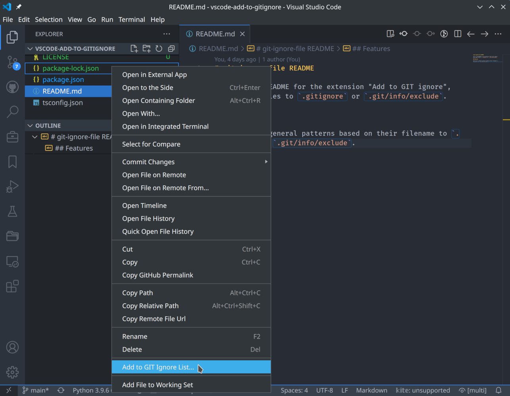
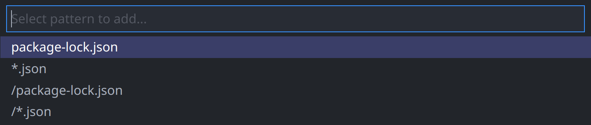

# git-ignore-file README

This is the README for the extension "Add to GIT ignore", which adds files to `.gitignore` or `.git/info/exclude`.

## Features

Add files or general patterns based on their filename to `.gitignore` or `.git/info/exclude`.

## Usage

Right-click the file in the *Explorer* and select `Add to GIT Ignore List...`.

A list of possible patterns based on the filename of your selected file appears. Choose the one you like.

Next, you need to select whether to add the pattern to the `.gitignore` file (this file is usually shared in GIT) or to `.git/info/exclude` (select this if you do not want to share the exclusion).

## Release Notes

See the [changelog](CHANGELOG.md)
